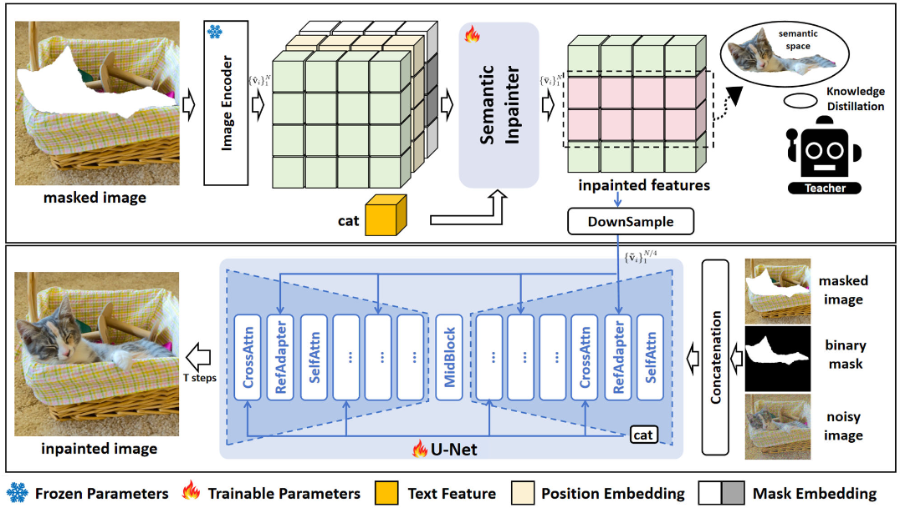
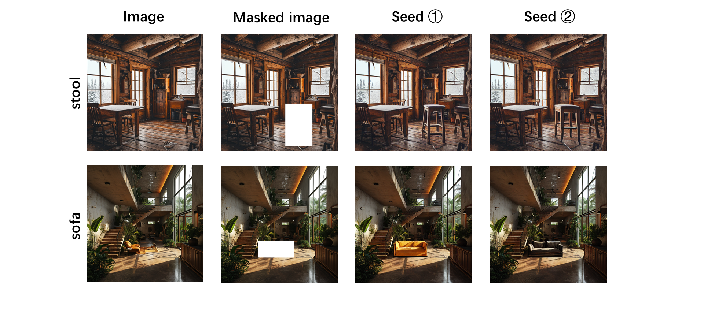
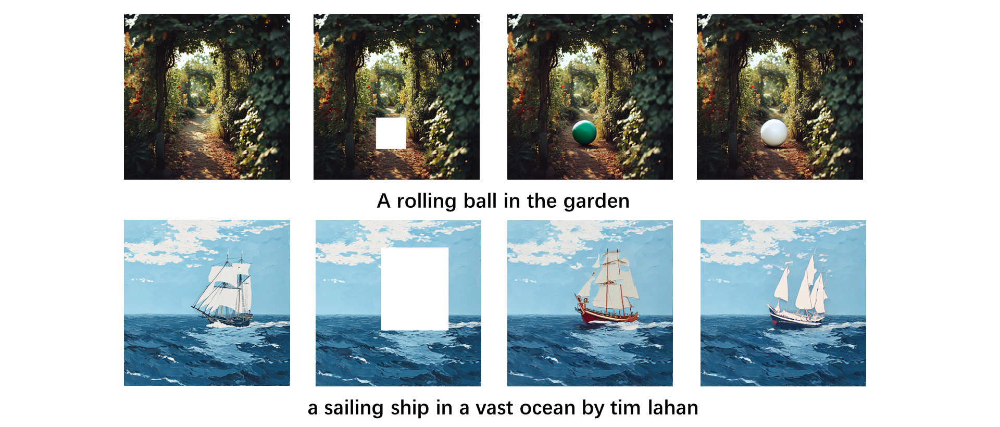
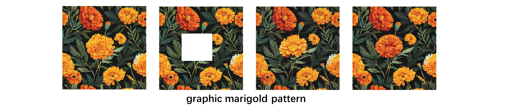
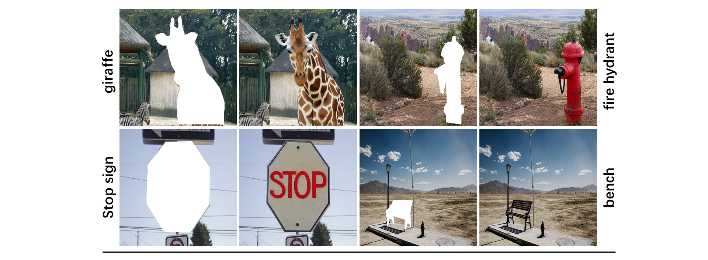
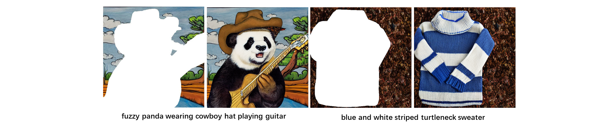

# CATdiffusion
Official implementation of Improving Text-guided Object Inpainting with Semantic Pre-inpainting in ECCV 2024.

> **Improving Text-guided Object Inpainting with semantic Pre-inpainting**

 &nbsp;

## Installation
1. Clone the repository
```sh
https://github.com/Nnn-s/CATdiffusion
```
2. Create a conda environmenta and install required packages
```sh
conda env create -f environment.yaml
conda activate catdiffusion
```

## Inference
**Infer with dataset:**
```sh
python dataset_infer.py --ckpt test.ckpt --output_dir results --config ./models/mldm_v15.yaml
```

```sh
{'mask_image': 'test/labels/masks/6/611cf47482fe991f_m01bjv_8ae41a6b.png', 
'label': 'Bus', 
'box_id': '8ae41a6b', 
'area': 0.42109375000000004, 
'box': [0.234375, 0.285417, 0.765625, 0.55], 
'image_id': '611cf47482fe991f', 
'image': 'test/data/611cf47482fe991f.jpg'}
```

## Train:

The training process is divided into two stages. In the first stage, the Semantic Inpainter and UNet w/ Reference Adapter are optimized using feature distillation loss and diffusion loss, respectively. In the second stage, the full model CAT-Diffusion is finetuned using diffusion loss. Specifically, only the Semantic Inpainter is tuned keeping the other modules frozen in early steps, and in later steps, the UNet w/ Reference Adapter is unfrozen and tuned as well.

### Stage1:

**1. Convert the weights of the [base model](https://huggingface.co/runwayml/stable-diffusion-inpainting/tree/main) into customized format:**

```sh
python tool_stage1.py --input_path sd-v1-5-inpainting.ckpt --output_path ckpt_for_stage1.ckpt --config ./models/mldm_v15.yaml
```

**2. Train Semantic Inpainter:**

```sh
python train.py --ckpt ckpt_for_stage1.ckpt --config ./models/mldm_v15_stage1.yaml --save_path ./stage1_Semantic_Inpainter
```

**3. Train Unet and Reference Adapter:**

```sh
python train.py --ckpt ckpt_for_stage1.ckpt --config ./models/mldm_v15_unet_only.yaml --save_path ./stage1_Unet
```

### Stage2:

**1. Merge the pre-trained weights from Stage 1:**

```sh
python tool_merge_for_stage2.py --stage1_path ./stage1_Semantic_Inpainter/last.ckpt --input_path ./stage1_Unet/last.ckpt --output_path ckpt_for_stage2.ckpt --config ./models/mldm_v15.yaml
```

**2. Finetune Semantic Inpainter with diffusion loss:**

```sh
python train.py --ckpt ckpt_for_stage2.ckpt --config ./models/mldm_v15_stage2_1.yaml --save_path ./stage2_1
```

**3. Full finetune:**

```sh
python train.py --ckpt stage2_1/last.ckpt --config ./models/mldm_v15_stage2_1.yaml --save_path ./stage2_2
```

## Citation
```
@article{Chen2024CATiffusion,
  title={Improving Text-guided Object Inpainting with semantic Pre-inpainting},
  author={Yifu Chen, Jingwen Chen, Yingwei Pan, Yehao Li, Ting Yao, Zhineng Chen, and Tao Mei},
  journal={ECCV},
  year={2024}
}
```


## Generated Examples
### Bounding Box mask inpainted results:
 &nbsp;
 &nbsp;
 &nbsp;

### Segmentation mask inpainted results:
 &nbsp;
 &nbsp;
